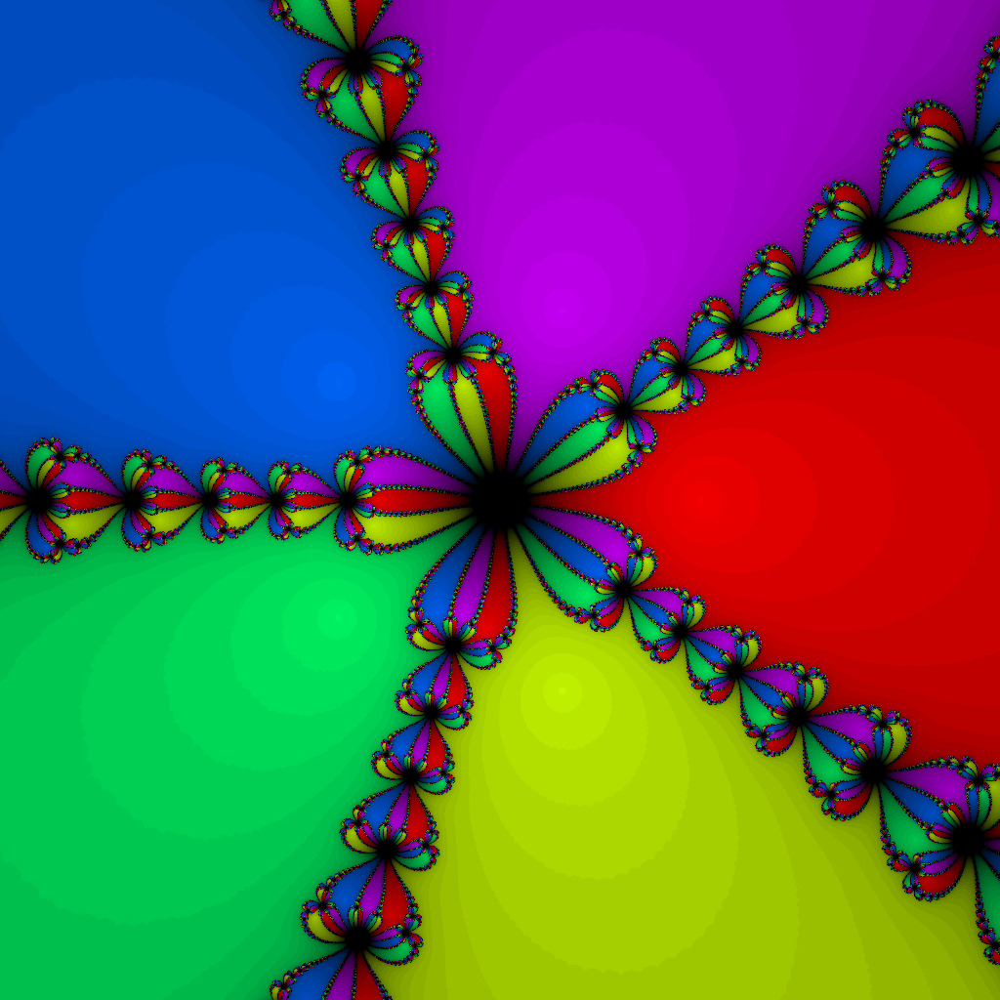

# ❄️ ISPC Newton fractal

This repository demonstrates how to generate a **Newton fractal** using both **serial C++ code** and two **ISPC (Intel SPMD Program Compiler)** implementations:

- A **standard ISPC version** using straightforward SPMD parallelism.
- A **tasks-based ISPC version** that utilizes ISPC’s task system for better parallel scaling on multi-core CPUs.

## Table of Contents

- [Overview](#overview)
- [Prerequisites](#prerequisites)
- [Repository Structure](#repository-structure)
- [Building & Running in CLion](#building--running-in-clion)
- [Results](#-results)
- [License](#-license)


## Overview

This project compares three implementations of Newton fractal generation:

1. **Serial C++ implementation** — a straightforward CPU version.
2. **ISPC SPMD version** — uses ISPC for data-parallel computation.
3. **ISPC tasks version** — leverages ISPC’s task model for multi-core execution.

Execution times are measured using the included `timing.h` header (adapted from Intel’s ISPC samples).  
The provided CMake configuration handles all necessary compilation and linking automatically:

- Compiles `.ispc` files into object code and integrates them with C++.
- Supports both standard and task-based ISPC variants.
- Generates targets you can run directly from **CLion**.

## Prerequisites

Before building, ensure you have:

1. **ISPC compiler** installed and accessible in your `PATH` (or specify its location).
2. A working **C++ compiler** and toolchain (e.g. GCC, Clang).
3. **CMake** (minimum version requirement as defined in `CMakeLists.txt`).
4. (Optional) CLion or another IDE that supports CMake — but you can also build from the command line.

If ISPC is not in your `PATH`, you may need to adjust the CMake variables (e.g. `ISPC_EXECUTABLE`) to point to it.


## Repository Structure

Here is the top-level layout and what each part does:
```
/
├── CMakeLists.txt
├── main.cpp
├── tasksys.cpp
├── ispc/
└── include/
```

### Key Components

- **CMakeLists.txt**  
  Handles automatic ISPC compilation, linking, and C++/ISPC target setup.

- **main.cpp**  
  Entry point for the application; coordinates and runs the serial and ISPC fractal versions.

- **tasksys.cpp**  
  Provides a simple thread pool / task system required by ISPC’s `launch` and task-based execution model (incorporated Intel samples file).

- **ispc/**  
  Contains ISPC source files:
  - `newton.ispc`: baseline ISPC version.
  - `complex.ispc`: helper functions for complex arithmetic.

- **include/**  
  Header files shared across the project:
  - `timing.h`: timing and benchmarking utilities (from Intel samples).
  - `colours.h`: defines RGB palette logic.
  - `newton_cxx.h`: C++ serial version.


## 🛠️ Building & Running in CLion

Thanks to the integrated CMake configuration:

1. Open the project in **CLion**.
2. Let it load the CMake configuration.
3. Select the main target and click **Run** or **Debug**.

CLion automatically:
- Invokes ISPC for `.ispc` files,
- Compiles C++ sources,
- Links everything together,
- Runs the program with no manual setup needed.

Alternatively, you can build from the command line:

```bash
mkdir build
cd build
cmake ..
cmake --build .
./newton_frac
```

## 📊 Results

The program was run on MacBook M2 with different implementations (serial C++, ISPC, and ISPC tasks) and generated output images (`.ppm`). Performance was measured in **million CPU cycles**, and speedups were calculated relative to the serial version.

### Example Run: n = 71

| Implementation      | Best Time (million cycles) | Speedup vs Serial |
|--------------------|----------------------------|-----------------|
| Serial C++         | 8803.99                    | 1.0x            |
| ISPC               | 1804.09                    | 4.88x           |
| ISPC Tasks         | 357.078                    | 24.66x          |

### Example Run: n = 7

| Implementation      | Best Time (million cycles) | Speedup vs Serial |
|--------------------|----------------------------|-----------------|
| Serial C++         | 1230.53                    | 1.0x            |
| ISPC               | 231.4                      | 5.32x           |
| ISPC Tasks         | 42.8896                    | 28.69x          |

---

### Sample Generated Fractal

Below is an example of the Newton fractal (n = 5) produced by the program:



## 📑 License

This project is licensed under GPL-3.0 license. See the [LICENSE](LICENSE) file for the full license text.
